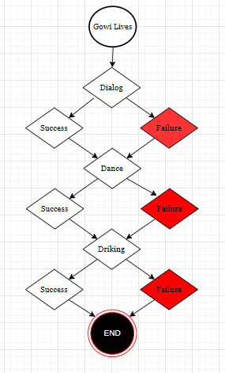

# Utility for Dynamic Binary Trees
<!-- --- --- --- --- --- --- --- --- --- --- --- --- --- -->
### Author & License   : 
    Waajacu
    MIT License
### Run code localty (Linux):
```sh
source ./compile.sh
```
<!-- --- --- --- --- --- --- --- --- --- --- --- --- --- -->
### Desing  :
    There are Trees
                : trees have nodes
                : trees have a dynamic color payload
    There are Nodes
                : nodes have color tensor 
                : nodes have reference
                : nodes have action
                : nodes have transiton_function
<!-- --- --- --- --- --- --- --- --- --- --- --- --- --- -->
### Fixes
        : node validation always returns true
        : node destructor does not delocate ref vectors
<!-- --- --- --- --- --- --- --- --- --- --- --- --- --- -->
<!-- --- --- --- --- --- --- --- --- --- --- --- --- --- -->
### Reference 
        : KaoShi     /    exam
        : JanSe      /    color
        : Jiyi       /    memory
        : CanKao     /    node reference
        : JieDian_t  /    node
        : Shu        /    tree
--- --- --- --- --- --- --- --- --- --- --- --- ---
### Example diagram

### Example
          THE EXAMPLE OF GOWI
        
        : Node state transition sums honor points 
        : Node state transition prints a phrase in the terminal. 
        
        : Honor is the performance mesure of Gowi
        : Phrases are the narration of Gowi's life
         
        : Gowi is born with some honor points.
        : every success gives some honor points.
        : every failure takes some honor points.
         
        : Gowi is up to win the most points if 
        : revolution event is a success.---like a game 
        : modeleded using dynamic binary nodes.
### Example results:
```sh
'Gowi Life results:
   Total Honor:  278.000000
   Total Story: 
	    subject Gowi lives 
	 [dialog event encounter:] 
	    success in dialog 
	 [painting event encounter:] 
	    success in painting 
	 [dancing event encounter:] 
	    success in dancing 
	 [drinking event encounter:] 
	    success in drinking 
	 [love making event encounter:] 
	    success in love making 
	 [childhood event encounter:] 
	    success in childhood 
	 [parenthood event encounter:] 
	    success in parenthood 
	 [finalhood event encounter:] 
	    success in oldhood 
	 [revolution event encounter:] 
	    revolution success 
    subject Gowi dies a long life.'
```